# Day 0 Retina Multiome: ArchR Preprocessing and QC

This repository contains the current ArchR workflow and result previews for two
10x Multiome retina samples collected at Day 0.

### Samples

| Sample | Genotype | Condition | Day | ATAC fragments | RNA feature matrix |
| --- | --- | --- | --- | --- | --- |
| TH1 | Chx10Cre | Control | Day0 | `Sample_15585-TH-1/atac_fragments.tsv.gz` | `Sample_15585-TH-1/filtered_feature_bc_matrix.h5` |
| TH2 | Chx10Cre/Insm1 KO | KO | Day0 | `Sample_15585-TH-2/atac_fragments.tsv.gz` | `Sample_15585-TH-2/filtered_feature_bc_matrix.h5` |

Raw 10x output files are intentionally excluded from git. The sequencing core
aligned both samples with `refdata-cellranger-arc-GRCm39-2024-A`; the project
uses the same GRCm39/mm39 reference for ArchR compatibility.

### Filtering Thresholds

#### Cell Filtering Criteria

Cells are first imported with loose Arrow-file thresholds, then filtered after
the RNA matrix is added so ATAC and RNA QC are applied to the same cells.
After first-pass annotation, old combined clusters `C1` and `C10` were removed
and the ATAC/RNA/combined embeddings and clusters were recomputed.
ArchR renumbers clusters after reclustering, so new labels named `C1` or `C10`
can appear again; those are not the original excluded clusters.

- Arrow creation minimum TSS: `1`
- Arrow creation minimum fragments: `100`
- Combined QC TSS enrichment: `> 10`
- Combined QC ATAC fragments: `> 1000`
- RNA detected genes: `> 1000` and `< 7000`
- RNA UMIs: `> 1500` and `< 30000`
- RNA mitochondrial percent: no cutoff in the current run
- Doublet removal: disabled by default; doublet scores are retained

Full settings:
[script 02](results/r_demo_archr/filter_settings_script_02.csv) and
[script 04](results/r_demo_archr/filter_settings_script_04.csv).

### Filtering Summary

| Sample | Before combined filtering | After combined filtering | Retention |
| --- | ---: | ---: | ---: |
| TH1 | 16,233 | 15,693 | 96.7% |
| TH2 | 16,720 | 16,054 | 96.0% |
| Total | 32,953 | 31,747 | 96.3% |

### Cluster Exclusion Summary

| Sample | Before C1/C10 exclusion | Removed C1/C10 | After reclustering |
| --- | ---: | ---: | ---: |
| TH1 | 15,693 | 92 | 15,601 |
| TH2 | 16,054 | 122 | 15,932 |
| Total | 31,747 | 214 | 31,533 |

Additional count tables:
[cell_counts_after_qc.csv](results/r_demo_archr/cell_counts_after_qc.csv),
[cell_counts_after_rna_combined.csv](results/r_demo_archr/cell_counts_after_rna_combined.csv), and
[cell_counts_summary.csv](results/r_demo_archr/cell_counts_summary.csv).
Cluster exclusion tables:
[removed clusters](results/r_demo_archr/removed_clusters_before_reclustering.csv) and
[post-exclusion counts](results/r_demo_archr/cell_counts_after_cluster_exclusion_reclustered.csv).

## UMAPs

### ATAC

[Full PDF](results/figures/umap/umap_sample_clusters.pdf)

<p>
  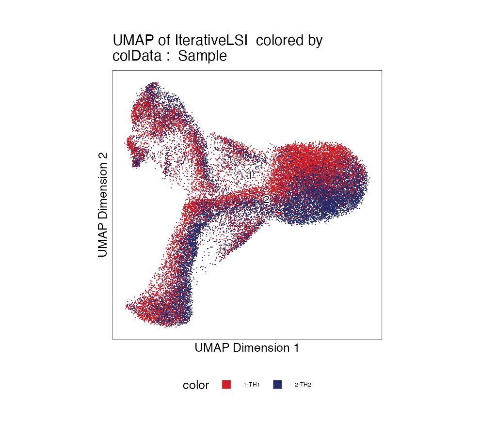
  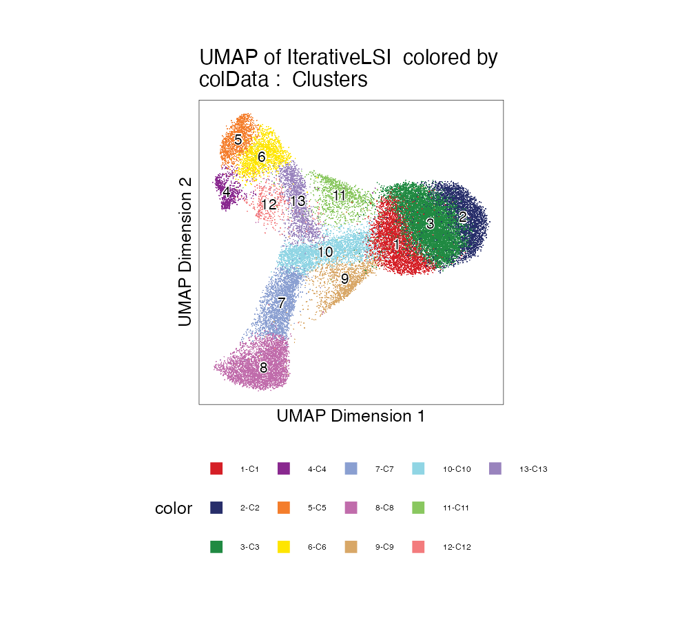
</p>

### RNA / Combined

[Full PDF](results/figures/combined_umap/rna_combined_umap.pdf)

<p>
  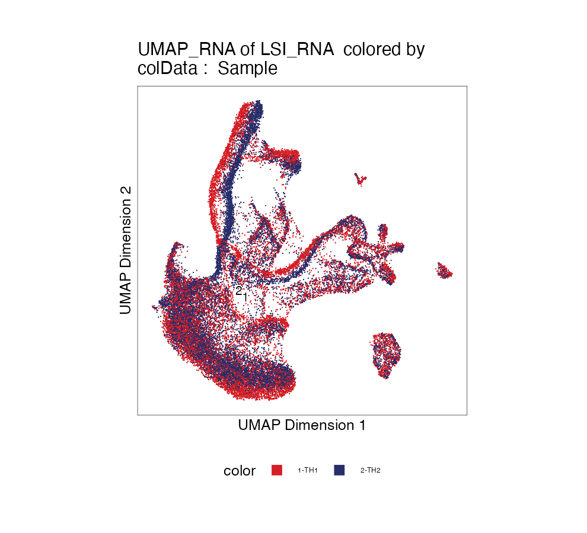
  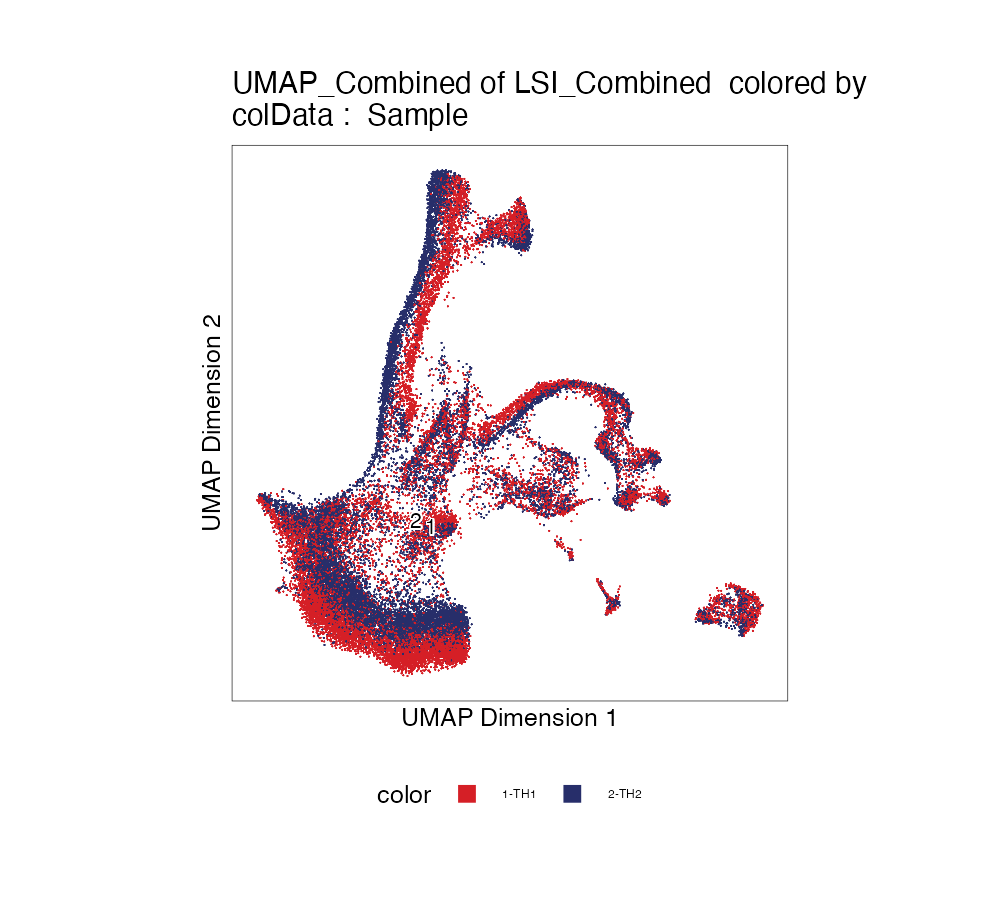
  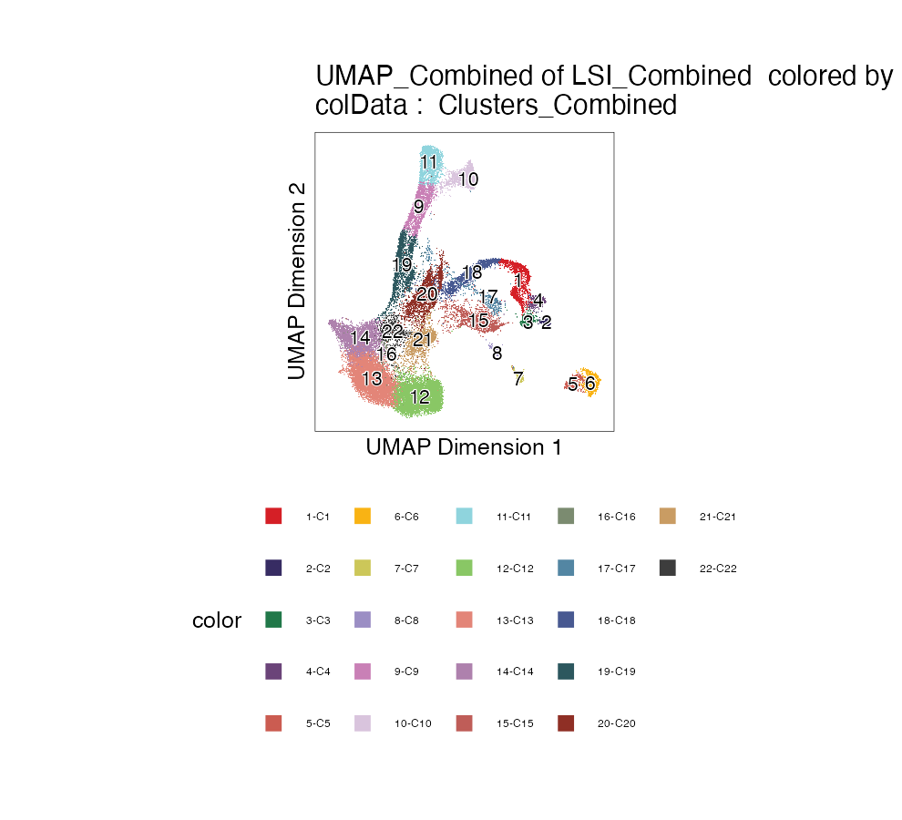
</p>

## QCs

### RNA

[Full PDF](results/figures/cluster_qc/Clusters_RNA_QC.pdf)

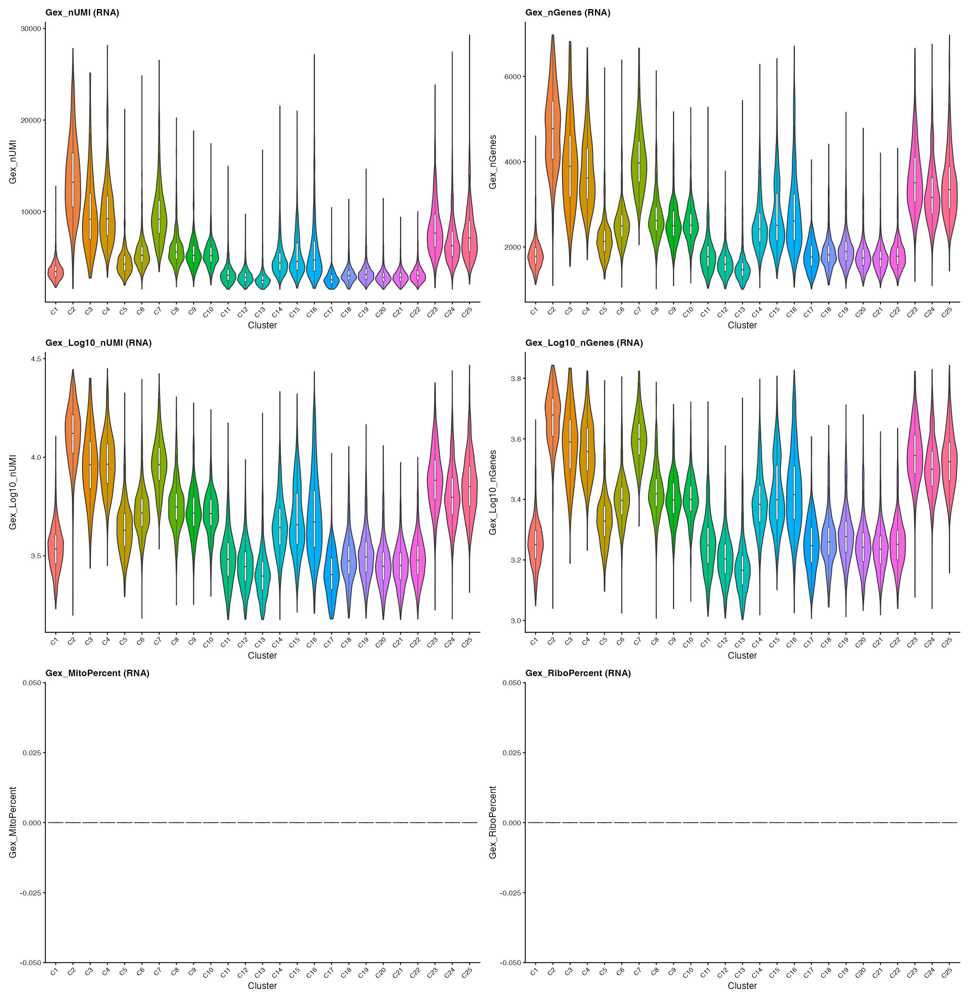

### ATAC

[Full PDF](results/figures/cluster_qc/Clusters_ATAC_QC.pdf)

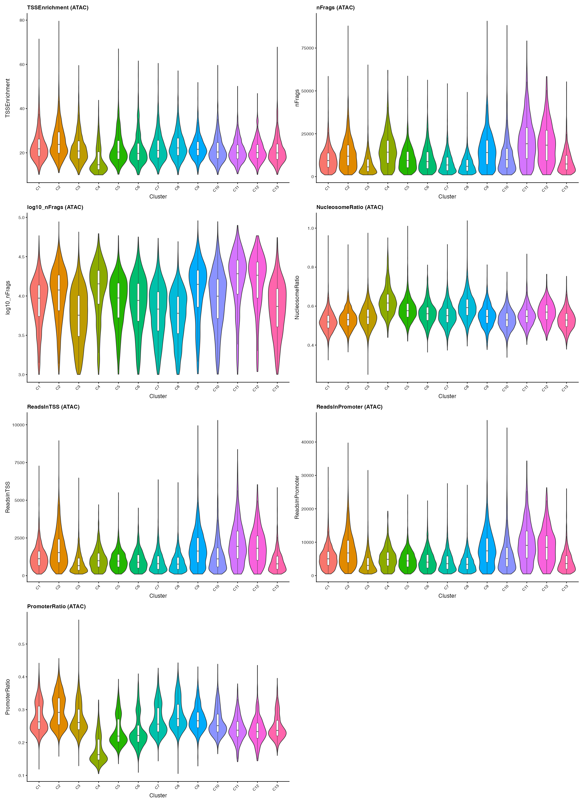

### Combined

[Full PDF](results/figures/cluster_qc/Clusters_Combined_QC.pdf)

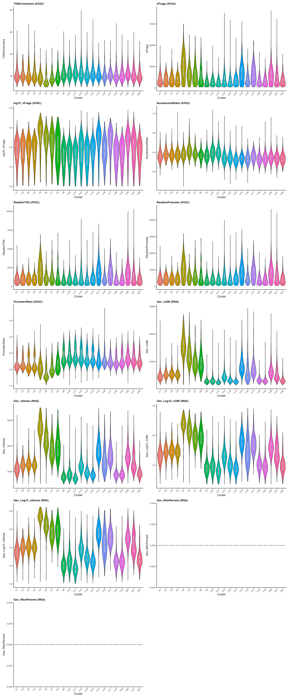

### Pre-filter QC Views

<p>
  
  
</p>

Full PDFs:
[TSS enrichment](results/figures/qc/tss_enrichment.pdf) and
[RNA QC by sample](results/figures/rna_qc/rna_qc_by_sample.pdf).

## Marker Genes

RNA marker UMAPs are plotted from the `GeneExpressionMatrix` using per-gene
expression Z-scores on `UMAP_Combined`. The gallery includes retinal identity
markers, added bipolar/astrocyte/endothelial-pericyte/RPE markers, neurogenic
and stress markers, and `Malat1` as a low-quality diagnostic.

<p>
  
  
  
  
  
  
  
  
  
  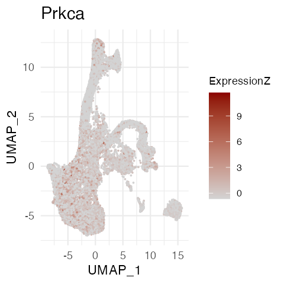
  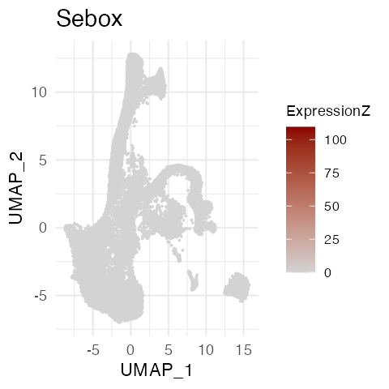
  
  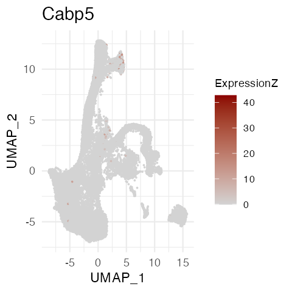
  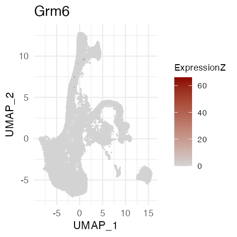
  
  
  
  
  
  
  
  
  
  
  
  
  
  
  
  
  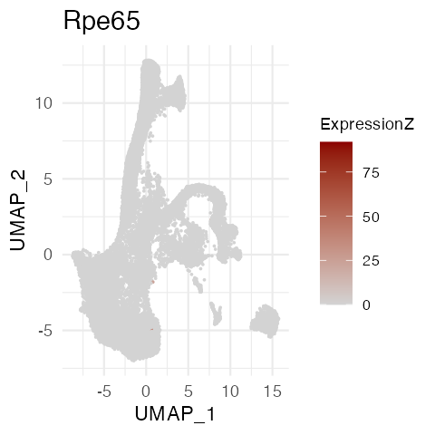
  
  
  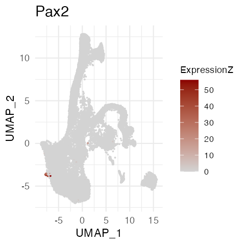
  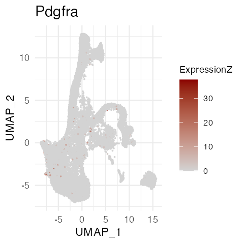
  
  
  
  
  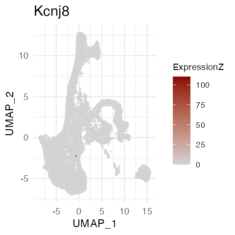
  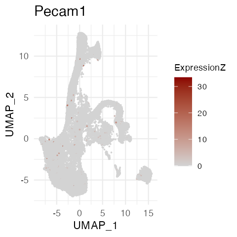
  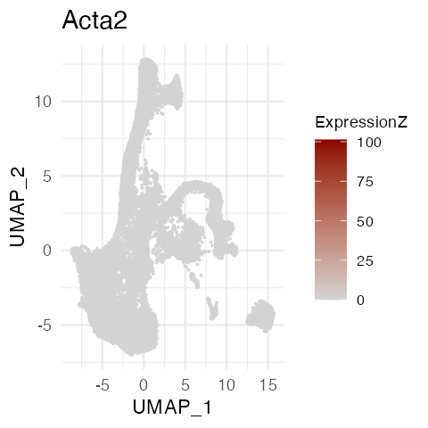
  
  
  
  
  
  
  
  
  
  
  
  
  
  
  
  
  
  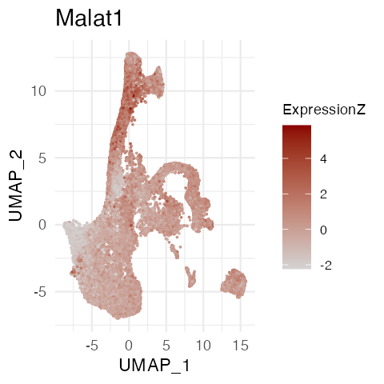
</p>

Marker tables:
[marker sets](results/r_demo_archr/retinal_marker_sets.csv),
[RNA marker presence](results/r_demo_archr/marker_presence_gene_expression_matrix.csv),
[gene-score marker presence](results/r_demo_archr/marker_presence_gene_score_matrix.csv), and
[ExpressionZ summary](results/r_demo_archr/rna_marker_expression_z_summary.csv).

## Marker Peaks

Peak calling is prepared in
[`scripts/10_call_peaks_add_peak_matrix.R`](scripts/10_call_peaks_add_peak_matrix.R).
The script builds group coverages by `Clusters_Combined`, calls reproducible
peaks with MACS2, adds a peak matrix, and exports the updated project. Complete
this step before interpreting differential accessibility or marker peaks.

## Run Order

Run from the project root with the ArchR conda R:

```sh
conda activate archr
Rscript scripts/00_check_install.R
Rscript scripts/01_create_arrows.R
Rscript scripts/02_build_project_qc.R
Rscript scripts/03_reduce_cluster_umap.R
Rscript scripts/04_add_multiome_rna_combined_embedding.R
Rscript scripts/12_remove_clusters_recluster.R
Rscript scripts/05_summarize_cell_counts.R
Rscript scripts/06_compare_clustering_parameters.R
Rscript scripts/07_annotate_retinal_celltypes.R
Rscript scripts/08_export_readme_marker_pngs.R
Rscript scripts/13_export_readme_umaps.R
Rscript scripts/09_celltype_proportions.R
Rscript scripts/10_call_peaks_add_peak_matrix.R
Rscript scripts/11_cluster_qc_violin_plots.R
```

If VS Code resolves `Rscript` to system R, use the conda Rscript directly:

```sh
/Users/louis/miniforge3/envs/archr/bin/Rscript scripts/07_annotate_retinal_celltypes.R
```

## Reference Setup

Set the 10x ARC reference path before running if it is not in the project root:

```sh
export TENX_ARC_REFERENCE_DIR=/path/to/refdata-cellranger-arc-GRCm39-2024-A
```

Expected files inside the reference include:

- `fasta/genome.fa`
- `fasta/genome.fa.fai`
- `genes/genes.gtf`
